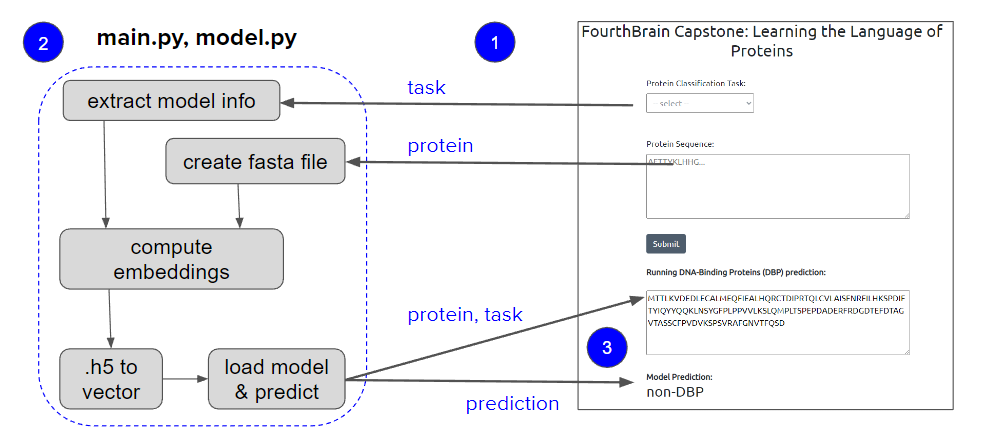
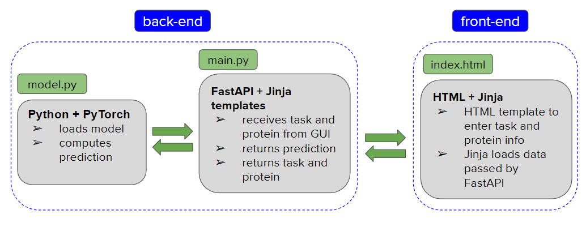

# Application

For our application we have chosen the best performing model for each classification task.

| Task | Best performing model | Accuracy |
| ---- | --------------------- | --------------- |
| ACP | dlm\_avg\_svm         | 0.75            |
| AMP | mt\_avg\_lr           | 0.94            |
| DBP | dlm\_max\_rf          | 0.88            |

## Application Workflow

The application workflow starts with the task and protein being passed from the front-end to our back-end scripts.

The diagram shows the full path from ingestion of the task and protein info to prediction:

- The model info is extracted from the task, and the fasta file is created from the protein.
- They are both used to compute protein representation that is stored in .h5 format.
- The loaded model accepts the vector extracted from the .h5 file and computes prediction.

 At the end, prediction, together with the task and protein are passed to the front-end.

## Application Deployment

The back-end side uses **FastAPI** with **Jinja** templates, **Python** and **PyTorch**:

- receives the task and protein info 
- loads the model
- computes, and returns prediction

On the front-end we use 

- **HTML** template to enter the information and 
- **Jinja** to load data passed from FastAPI.

The application is containerized using Docker.
