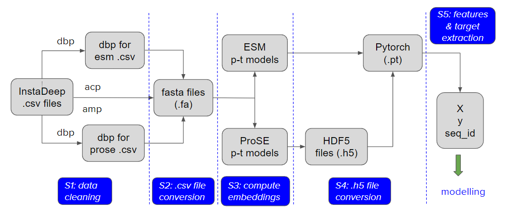
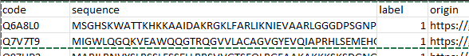
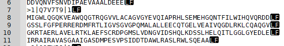
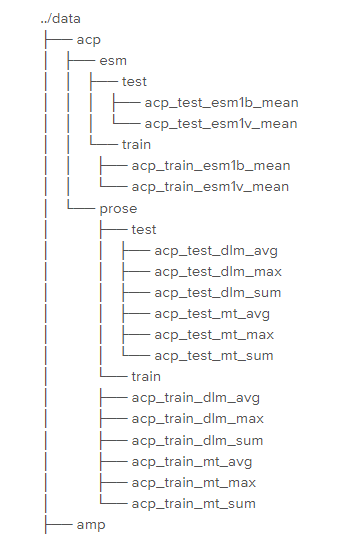

# Embeddings

## Data Flow Overview

- We started with the cleaning step as some data that we received from InstaDeep needed to be cleaned before further processing. 
- The pre-trained models we used accept sequences in fasta format, hence in the 2nd step we converted .csv files to fasta files.
- In the 3rd step we computed embeddings.
- To have ProSE embeddings stored in the same format as the output from ESM models, in the 4th step we converted .h5 files to .pt (PyTorch) files.
- And finally, in the 5th step we extracted features and a target variable, and we were ready for modelling.

## Step 1: Cleaning

### Input data

These are the files that we received from InstaDeep for each task:

| Task         | File 1         | File 1 - Dimensions | File 2          | File 2 - Dimensions |
| ------------ | -------------- | ------------------- | --------------- | ------------------- |
| acp          | test\_data.csv | (344, 2)            | train\_data.csv | (1378, 2)           |
| amp          | all\_data.csv  | (4042, 3)           |                 |                     |
| dna\_binding | test.csv       | (2272, 4)           | train.csv       | (14189, 4)          |

The files are located in the corresponding task folders `../../data/<task_folder>`.

They have different dataset sizes, column names and column order so that made coding a little bit more complicated.

ACP datasets have only sequence and label and no sequence id, and we addressed that during the next step (conversion to fasta).

Only DBP test sequence ids contain a pipe character “|” (P53528|1). Because this character is used as a divider in fasta headers, we had to adjust coding to correctly work with all files.

### Cleaning Steps

These are the cleaning steps we performed:

**Duplicates**: They only exist in the DBP train dataset so we removed them.

**Long Sequences**: ESM pre-trained models were trained on sequences <= 1024. Because of that, we had to drop all sequences longer than 1024, when training ESM pipelines, but not for ProSE pipelines. It turned out that we really had to drop all sequences longer than 1022 because of the implementation of the pre-trained model.

**Lowercase Tokens** - ESM models do not accept lowercase letters in sequences. We found only one lowercase token in *dbp test* and converted it to uppercase.

Finally, we created separate versions of data files for ESM and ProSE: *train_esm.csv*, *test_esm.csv*, *train_prose.csv*, *test_prose.csv.

For more details refer to the notebook [DBP - Duplicates and seq >1022.ipynb](https://github.com/zunicd/Language-of-Proteins/blob/main/notebooks/embeddings/DBP%20-%20Duplicates%20and%20seq%20%3E1022.ipynb).

## Step 2: .csv File Conversion

We have received all files in the csv format. Both repositories with pretrained transformer models (Facebook's Evolutionary Scale Modeling, Protein Sequence Embeddings (ProSE)) are using fasta formatted files as input.

Let's look at these two formats:

**.csv**

**.fa, .fasta**

For this conversion we used the script **convert_csv_to_fasta.py** that contains the following functions:

- **csv_to_fasta** -  convert csv files to fasta files
- **separate_seq** - separates a sequence to 60-character chunks

This is the function call example:

`cf.csv_to_fasta(csv_file, fasta_file)`

where:

**csv_file**: path to our csv file (*../../data/acp/test_data.csv*)

**fasta_file**: path to fasta file we are going to create (*../../data/acp/test_data.fa*)

We followed the fasta header formatting used by ESM and adjust it for our data:

`>{index}|{sequence_id}|{label}`

where:
- `index` - index of the sequence in the fasta file  
- `sequence_id` - PBD code for the sequence  
- `label` - class label (0, 1) for the protein  

The function also generates missing sequence ids for ACP datasets:

**train** - Protein_seq_0001, Protein_seq_0002;..., Protein_seq_nnnn

**test** - Protein_seq_ts0001, Protein_seq_ts0002;..., Protein_seq_tsnnnn

More details can be found in the notebook [File Conversion - csv to fasta.ipynb](https://github.com/zunicd/Language-of-Proteins/blob/main/notebooks/embeddings/File%20Conversion%20-%20csv%20to%20fasta.ipynb)

## Step 3: Compute Embeddings

In this project we used pretrained models from [Facebook's Evolutionary Scale Modeling (ESM)](https://github.com/facebookresearch/esm) and [Protein Sequence Embeddings (ProSE)](https://github.com/tbepler/prose). Both of them accept fasta formatted files as input but they write embeddings in different formats. ESM stores embeddings in PyTorch `.pt` files (generated by `torch.save`), one file per fasta sequence, while ProSE writes embeddings out as an HDF5 file (`.h5`).

To store embeddings using an identical data format, we followed the data format used by ESM.   
Hence, we converted HDF5 file, generated by the ProSE embedding script, to `.pt` files.

### File Utilities and Arguments

The script **file_utilities.py** is a collection of several helper functions:

- **file_paths** - prepare paths for files and folders
- **convert_h5_to_pt** - convert h5 files to pt files
- **emb_files_stats** - prints stats for embedding folders
- **read_embeddings** - read embeddings from .pt files
- **check_with_df** - check our data using a Pandas DataFrame displaying only a few rows

To use the above functions, the most important thing is to correctly set arguments before running them. This is one example:

`ptmodel = 'esm'`

`task = 'acp'`

`pool = 'mean'`  

`file_base = 'train'`

`model = 'esm1v_t33_650M_UR90S_1'`

`emb_layer = 33`

This is the list of argument values:

- **pt_model**: pre-trained model repository → ['esm', 'prose']
- **task**: protein group → ['acp', 'amp', 'dna_binding']
- **file_base**: ['test', 'train', 'all_data']
- **model**: prose → ['prose_dlm, 'prose_mt']
                        esm → ['esm1v_t33_650M_UR90S_1', 'esm1b_t33_650M_UR50S']
- **pool**: pooling operation                  
                    prose → ['avg', 'max', 'sum']
                     esm → ['mean']
- **data_folder**: root of data folder → ['../../data'] default
- **emb_layer**: prose → ['layer']	esm → [33]

### Extracting Embeddings

This is the code to extract embeddings.

**ProSE**:

`path_pt, path_h5, path_fa = fu.file_paths(ptmodel, task, file_base, model, pool)`

`%run ../prose/embed_sequences --model "{model}" --pool "{pool}" -o "{path_h5}" "{path_fa}"`

**ESM**:

`path_pt, _, path_fa = fu.file_paths(ptmodel, task, file_base, model, pool)`

`%run "{extract}" "{model}" "{path_fa}" "{path_pt}" --repr_layers "{emb_layer}" --include "{pool}"` 

## Step 4: .h5 file conversion

This line of code converts `.h5` file to `.pt` files:

`fu.convert_h5_to_pt(path_h5, path_pt, pool)`

## Step 5: Features & Target Extraction

Before we start modelling we need to extract the features and target variable from `.pt` files:

`path_pt, _, path_fa = fu.file_paths(ptmodel, task, file_base, model, pool)`

`Xs, ys, sequence_id = fu.read_embeddings(path_fa, path_pt, pool, emb_layer)`

To make sure that everything is OK, this line will create a dataframe from the extracted features and target and then display 4 rows.

`fu.check_with_df(Xs, ys, sequence_id)`

## Data Recap

This table shows the final count and size of all files after all embedding vectors were computed and stored.

| Folders |  Files  |  Size  | Embedding Files | Embedding Size |
| :-----: | :-----: | :----: | :-------------: | :------------: |
|   59    | 174,264 | 6.5 GB |     174,218     |     3.4 GB     |

The top 3rd part of the data tree (acp) can be seen on this image. 

**NOTE:** The data is stored in the *data* directory in the root folder, but we could not share it in this repo due to its size and because we did not have permission from InstaDeep.

