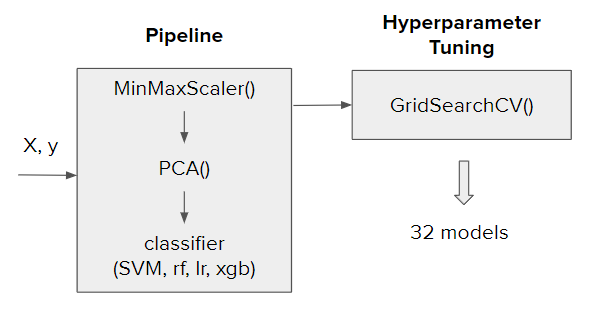

# Modelling

We used the previously computed embeddings as input to the modelling. 

For each classification task there are 8 combinations, as it is showed in the table below.

|       | number of p-t  models | pooling operations |
| ----- | ---------------------- | ------------------- |
| ESM   | 2                      | 1                   |
| ProSE | 2                      | 3                   |

We used 4 machine learning algorithms:

- SVM
- XGBoost
- Random Forest
- Logistic Regression

and all this together give us 32 models for each classification task.

## Modelling Pipeline

The image below displays the pipeline we used in this project.

## Modelling loop

For each tasks we were following the same modelling loop that includes the following steps:

1. Loop through train and test embedding folders
2. Run the function `read_embeddings()` for train embeddings to get `X_train` and `y_train`
3. Run the function `read_embeddings()` for test embeddings to get `X_test` and `y_test`
4. Define and print the output header
5. Use the function `fit_tune_CV()`to to do the following:
   - use above defined `pipelines` and `hp_grids` dictionaries and `GridSearchCV()` to get models
   - save the models with `joblib`
   - create a dictionary of the models for one set of embedding folders
6. Run the function `evaluation()` to create an evaluation dataframe for one set of embedding folders

For "AMP" the first three steps are slightly different:
1. Loop through embedding folders
2. Run the function `read_embeddings()` for all_data embeddings to get `X` and `y`
3. Split `X` and `y` into train and test sets

## Results

### Best Performers

For each task we created a dataframe with results for all 32 models and sorted them per accuracy. In the table below we listed the best performing models for each classification task.

| Task | Best performing model | Accuracy | f1_macro |
| ---- | --------------------- | --------------- | --------------- |
| ACP | dlm\_avg\_svm         | 0.75            | 0.75          |
| AMP | mt\_avg\_lr           | 0.94            | 0.94         |
| DBP | dlm\_max\_rf          | 0.88            | 0.88           |

The difference between best and worst performer was 6-8%.

Because the datasets are well balanced, accuracy and f1_amcro are pretty much the same.

### Top 10 prformers

We analyzed top 10 performers for each class and collected data in the table below:

| Task | Data Size (train, test) | dlm  | mt   | esm1b | esm1v | avg  | max  | sum  | xgb  | svm  | lr   | rf   |
| ---- | ----------------------- | ---- | ---- | ----- | ----- | ---- | ---- | ---- | ---- | ---- | ---- | ---- |
| ACP  | 1300, 300               | 4    | 4    | 1     | 1     | 6    | 1    | 3    | 2    | 5    | 3    | NaN  |
| AMP  | 3000, 1000              | 3    | 5    | NaN   | 2     | 6    | 2    | 2    | Nan  | 5    | 5    | NaN  |
| DBP  | 14000, 2200             | 5    | 3    | 1     | 1     | 5    | 3    | 2    | 6    | 2    | NaN  | 2    |

Some conclusions from this table:

- ProSE pretrained models outperform ESM, “dlm” and “mt” are pretty equal.

- Overall best performance is with “avg” pooling

- SVM is best universal performer.

- XGBoost is best for bigger files, Logistic Regression for smaller files.

- Random Forest performs good for “DBP”only.

  

For each of our classification tasks, we investigated two baseline models

1. Bag of Words (BoW) was used for sequence embedding, followed by a simple Neural Network which was used for binary classification
2. [Sequence Graph Transform (SGT)](https://github.com/cran2367/sgt) was used for sequence embedding, followed by a Neural Network with the same architecture as the BoW method for binary classification

Results are summarized below (Accuracy):
| Embedding   | Model         | ACP  |AMP   |DBP   |
| ----------- |:-------------:|-----:|-----:|-----:|
| BoW         | NN            | 68.1 |90.6  |79.1  |
| SGT         | NN            | 70.9 |82.5  |71.5  |

The BoW does not retain any sequence information. SGT uses the sequence information, but is not pre-trained on any protein data (it can handle any sequence data from scratch). It was rather surprising to see BoW do nearly as well (for ACP) or even better (for AMP and DBP).